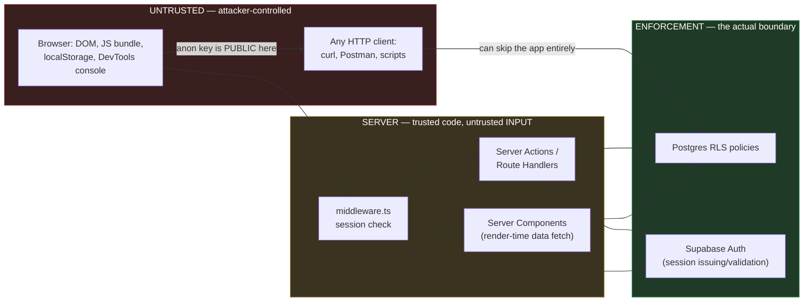

# Security Guide

Status: Planning phase. No code written yet — this doc is written to be followed *during*
development, not audited after it.
Last updated: 2026-08-08
Companion docs: [system-design.md](./system-design.md) (architecture), [plan.md](./plan.md)
(roadmap). This doc expands system-design.md §7 (admin access) and §11 (security surface)
into a full threat model, per-entry-point defenses, and development rules.

## 1. The one idea this whole document rests on

**Everything the browser receives is public, and everything the browser sends is attacker-
controlled.**

The UI is not a security boundary. Hiding a button, omitting a link, using an unlisted URL,
disabling a form field, or validating input in React are all *user experience* measures. An
attacker does not use your UI — they use DevTools, `curl`, and Postman against your
endpoints directly.

For this project the practical consequence is specific and worth stating plainly: the
Supabase anon key is shipped in the JavaScript bundle **by design**, and anyone can extract
it in about ten seconds and start making requests to the database's REST API from Postman.
That is not a bug and it is not a leak. The only reason it is safe is that **Postgres
Row Level Security is the real boundary**, enforced inside the database, on every request,
regardless of which client sent it. If RLS is wrong, no amount of frontend care helps. If
RLS is right, DevTools snooping is harmless.

Every rule below is a corollary of that idea.

## 2. Trust boundaries



Read the arrow from `Requests` straight to `RLS`: an attacker can bypass `middleware.ts`,
Server Actions, and every line of application code by calling Supabase's REST API directly.
Any control that exists *only* in the yellow band is bypassable. Controls in the green band
are not.

## 3. Attack entry points

The five places an attacker actually interacts with this system. Each gets: what they can
do, what stops them, and how to verify it's really stopped.

### 3.1 Browser DevTools / Inspect Element

**What's available to anyone who opens DevTools:** the complete JS bundle, every network
request and response, all cookies and `localStorage`, the full DOM including anything hidden
by CSS, React component props, and the React Server Component payload embedded in the HTML.
They can also edit any of it and re-run code from the console.

| Attack | Defense | Verify by |
|---|---|---|
| Extract the Supabase anon key from the bundle | Expected — the key is public by design. RLS is what protects data (§1) | Reading the RLS policy tests in §5.2, not by trying to hide the key |
| Un-hide a CSS-hidden or conditionally-rendered admin control on the public site | Never render admin controls into public pages at all — the admin UI is a separate route tree (`/admin/**`), not a conditional branch inside public components | View-source a public page logged out; no admin markup, action IDs, or endpoints should appear anywhere in it |
| Read privileged data that a Server Component fetched but didn't visibly display | Only query the fields a page actually renders. Data fetched in a Server Component is serialized into the RSC payload in the HTML **even if never displayed** | Search the raw HTML (`curl` the page, don't just Inspect) for any field that shouldn't be public — e.g. `contact_email` if it's meant to be private |
| Steal the session token from storage | Use Supabase's cookie-based session with `httpOnly` cookies via the SSR client, so JS cannot read the token. Avoid the localStorage-based browser client for authenticated admin state | In DevTools console, `document.cookie` must not reveal the session token; Application tab shows the auth cookie flagged `HttpOnly` |
| Edit form values / disabled fields before submit | Client validation is UX only. Re-validate every field server-side with the same Zod schema (§4.2) | Submit a deliberately invalid payload from Postman (§3.3) and confirm it's rejected |

**Development rule:** before shipping any page, `curl` it logged-out and read the raw HTML.
If a field you consider private appears in that output, it is public — no exceptions.

### 3.2 URL manipulation

Every URL is editable. Route params, query strings, and path segments are all user input.

| Attack | Defense | Verify by |
|---|---|---|
| Navigate directly to `/admin` or any admin sub-route | `middleware.ts` session + allow-list check on `/admin/**` before any page code runs (system-design.md §7) | Log out, visit every admin route directly, confirm redirect to login every time |
| Guess an unlisted/unpublished route, e.g. `/projects/some-draft-slug` | If a `published` flag is ever added, filter on it in the query itself and in the RLS policy — never rely on the item merely being absent from the listing page | Query a draft slug directly while logged out |
| IDOR — change an id in an admin URL (`/admin/projects/<other-id>`) to touch another record | Single-owner site, so the blast radius is limited to the owner's own data — but the RLS policy still scopes writes to the allow-listed identity rather than trusting the id in the URL | Attempt an update with a valid session but a fabricated record id |
| Open redirect via a login `?redirect=` / `?next=` param | Allow only same-origin relative paths; reject anything starting with `//`, `http://`, or `https://`. Prefer a hardcoded post-login destination and skip the param entirely for v1 | Try `?redirect=https://evil.example` and confirm it does not navigate off-site |
| Reflected XSS via a query param rendered into the page | React escapes interpolated values by default. The rule is simply: never use `dangerouslySetInnerHTML`, and never pass a URL param into it | Grep the codebase for `dangerouslySetInnerHTML` — the intended count is zero |
| `javascript:` or `data:` URI stored in a project's `demo_url`/`source_url` and rendered as a link | Validate stored URLs against an `https?://` allow-list at write time (Zod `.url()` plus a protocol check), because this is admin-authored content rendered publicly | Try saving `javascript:alert(1)` as a project URL through the admin form |

**Development rule:** treat every route param and query value as hostile string input. It
goes through a Zod schema before it reaches a database query or the DOM — same as form data.

### 3.3 Direct API access (Postman, curl, scripts)

The highest-value section here, because it's the surface people forget exists. Two distinct
endpoints are reachable without ever loading the site:

**A. Supabase PostgREST API** — `https://<project>.supabase.co/rest/v1/<table>`, callable
with the public anon key. This is the single most important thing to get right in the entire
project.

- Without RLS enabled on a table, that URL is an unauthenticated, internet-facing
  read/write interface to your database. `DELETE /rest/v1/projects` with the anon key would
  simply work.
- With RLS enabled and correct, the same request returns an empty set or a permission error.
- **RLS is not on by default for tables created via raw SQL.** Every migration that creates a
  table must also enable RLS and define policies in the same migration (§4.1).

**B. Next.js Server Actions and Route Handlers** — Server Actions compile to POST endpoints
identified by an action id that is visible in the client bundle. They can be invoked
directly, with any payload, by anyone who reads that id. A Server Action is a public API
endpoint that happens to be written in a component file.

| Attack | Defense | Verify by |
|---|---|---|
| Call PostgREST directly to read data | Acceptable for public content (the site is public); RLS `select` policy defines exactly what's readable | Confirm the readable set matches what the public site shows and nothing more |
| Call PostgREST directly to insert/update/delete | RLS write policies restricted to the single allow-listed admin identity | The Postman check in §5.2 — the definitive test |
| Invoke a write Server Action directly, skipping the admin UI | Every Server Action independently re-checks the session and allow-list at its top, then re-validates the payload with Zod. It must never assume "the UI wouldn't have called me otherwise" | Replay a captured Server Action POST from Postman with the session cookie removed |
| Replay a captured admin request later | Supabase sessions expire and refresh; keep default expiry rather than extending it | Re-send a captured authenticated request after logging out |
| Brute-force the login endpoint | Supabase Auth applies its own rate limiting/backoff; magic-link login removes the password-guessing surface entirely | Rapid repeated login attempts should be throttled |

**Development rule — the Postman Test:** for every new write path, before considering it
done, call it from Postman with (a) no auth, and (b) a valid session for a non-allow-listed
account. Both must fail *at the database*, not just in the UI. If you can only make it fail
by removing a button from the interface, it isn't secured.

### 3.4 Forms and user-submitted content

The contact form is the only place an unauthenticated stranger writes anything.

| Attack | Defense |
|---|---|
| Spam / bot submissions | Form provider's built-in filtering (Web3Forms/Formspree) + a honeypot field + a minimum time-to-submit check |
| Header/email injection via form fields (`\n` + `Bcc:` in a name field) | The form provider handles delivery — do not build a custom mail sender. Strip newlines from any single-line field regardless |
| Volume abuse burning the provider's free-tier quota | Provider-side rate limits; monitor the quota. Worst case is a broken form, not a data breach |
| Stored XSS via submitted content | Contact submissions are delivered to email and never rendered on the site — there is no stored-XSS path here. Keep it that way: if submissions are ever displayed, they need escaping and review |

### 3.5 File uploads (avatar, resume) — Phase 3+

Only relevant if Supabase Storage upload is enabled in the admin panel.

- Restrict to an explicit MIME allow-list (`image/png`, `image/jpeg`, `image/webp`,
  `application/pdf`) and validate server-side — the `accept` attribute on the input is UX only.
- Enforce a maximum file size in the Storage bucket policy, not just in the form.
- Never trust the client-supplied filename: generate the stored name server-side (UUID) to
  eliminate path traversal and overwrite attacks.
- Serve uploads from Supabase Storage's own domain, not proxied through the app origin, so a
  malicious file can't execute in the site's origin.
- Storage buckets have their own access policies, separate from table RLS — set them
  explicitly (public read for avatars is fine; public *write* never is).

## 4. Development rules

Follow these while writing code. They are the operational form of §1.

### 4.1 Database

0. **REVOKE write privileges from `anon` in every migration that creates a table.**
   Supabase provisions each project with
   `alter default privileges in schema public grant all on tables to anon, ...`,
   so a new table arrives with `anon` already holding INSERT/UPDATE/DELETE. Granting
   `select` on top does not remove them. This rule is numbered 0 because it was
   learned the expensive way: migration 0001 asserted a privilege layer it never
   actually created, and only the ritual in §5.2 revealed it (see migration 0003).
1. Every `create table` migration enables RLS **in the same migration file**:
   `alter table <t> enable row level security;` — a table without a policy is either
   inaccessible or wide open, and both are bugs.
2. Write policies explicitly per operation (`select`, `insert`, `update`, `delete`) rather
   than one blanket `for all` policy — it makes "public can read, only admin can write"
   reviewable at a glance.
3. Write policies check the authenticated identity against the allow-listed admin, inside the
   policy. Application-layer checks are a second layer, never the only one.
4. No service-role key anywhere in the application (system-design.md §7.6). It bypasses RLS
   entirely; the design has no need for it, so its absence is itself a control.

### 4.2 Application code

5. Every Server Action begins with an auth guard (`lib/supabase/admin-guard.ts`) before any
   other logic, and validates its input with a Zod schema from `lib/schemas.ts` immediately
   after. Both, every time, no exceptions for "internal" actions.
6. The same Zod schema validates on both client and server. The client copy is for fast
   feedback; the server copy is the one that counts.
7. `NEXT_PUBLIC_` is a publication decision, not a naming convention. Anything with that
   prefix ships in the browser bundle. Only the Supabase URL and anon key get it.
8. Never `dangerouslySetInnerHTML`. If a future feature seems to need it, that's a design
   discussion, not a quick fix.
9. Fetch only the columns a page renders (§3.1) — over-fetching in a Server Component leaks
   into the HTML payload silently.

### 4.3 Repository and deployment

10. No secrets in git, ever — including in the migration files and seed data. If one is
    committed, rotating it is mandatory; deleting the commit is not sufficient, because the
    value is already in the remote's history and any clone. The same applies to chat logs,
    issues, and PR descriptions: nobody working on this codebase needs a secret's *value*,
    only its variable name. See [runbook.md](./runbook.md) §1 for which values here are
    genuinely secret (fewer than you would think — the anon key is public by design), where
    each belongs, and the rotation procedure.
11. `.env.local` stays git-ignored from the very first commit of Phase 1, before any env file
    exists to accidentally add.
12. **Verify Vercel preview deployment visibility before the admin panel ships (Phase 3).**
    Preview deploys build every PR at a public URL, running the admin code against whatever
    database the env vars point at. Confirm previews are access-protected, or point preview
    builds at a separate Supabase project — do not leave a publicly-reachable admin panel
    wired to production data. This is the most likely real-world mistake in this whole
    architecture, because nothing about it looks wrong locally.
13. Keep `main` protected: PR review before merge, CI green (system-design.md §10).

## 5. Vulnerability checks

### 5.1 Automated (set up once, runs continuously)

| Check | Tool | When | Cost |
|---|---|---|---|
| Vulnerable dependencies | Dependabot alerts + version-update PRs | Continuous | Free |
| Known CVEs at build time | `npm audit --audit-level=high` as a CI step | Every PR | Free |
| Static analysis / injection patterns | GitHub CodeQL (code scanning) | Every PR | Free for public repos |
| Leaked secrets in commits | GitHub secret scanning + push protection | Every push | Free for public repos |
| Security headers (CSP, HSTS, etc.) | securityheaders.com against the deployed URL | Per phase | Free |
| Best-practices baseline | Lighthouse "Best Practices" ≥ 95 (already a gate, system-design.md §9) | Per phase | Free |

Everything in this table is free. If the repo is private, CodeQL and secret scanning are the
two that may not be available — `npm audit` and Dependabot still are.

### 5.2 Manual — the RLS verification ritual

Run this whenever a table or policy changes. It is the single highest-value check in the
project, because it tests the actual boundary rather than a proxy for it.

Using Postman or `curl`, against the real Supabase project URL with the anon key:

```
1. GET    /rest/v1/projects                → expect: 200, public content only
2. POST   /rest/v1/projects  {...}         → expect: 401/403 — NOT 201
3. PATCH  /rest/v1/projects?id=eq.<real>   → expect: rejected, row unchanged
4. DELETE /rest/v1/projects?id=eq.<real>   → expect: rejected, row still present
5. Repeat 2-4 for every table: profile, experience, projects, skills
6. Repeat 2-4 with a valid session for a NON-allow-listed account → still rejected
```

**Reading the status codes matters as much as running the commands.**

- `401` / `403` — the privilege is absent. This is the expected pass.
- `204` on PATCH/DELETE — the request was *permitted* and simply matched no rows. Data is
  safe, because RLS filtered everything, but it means the privilege layer is missing and RLS
  is holding alone. Not a breach; not a pass either. This exact signal is what exposed the gap
  fixed by migration 0003.
- `200` / `201` / a 2xx that returns a row — a live vulnerability. Stop.

Any write that genuinely succeeds here is exploitable regardless of how the UI behaves. Step 6
is the one people skip, and it's the one that catches "authenticated" being confused with
"authorized."

To distinguish "refused" from "permitted but matched nothing", add
`-H "Prefer: return=representation"`: a permitted write returns the affected rows, a filtered
one returns `[]`.

### 5.3 Manual — pre-launch checklist

- [ ] Logged out, every `/admin/**` route redirects to login (not a partial render first)
- [ ] `curl` of every public page contains no private fields (§3.1)
- [ ] Session cookie is `HttpOnly`, `Secure`, `SameSite=Lax` or stricter
- [ ] `/admin` returns `noindex` and is absent from `sitemap.xml`
- [ ] Security headers present: CSP, `X-Content-Type-Options`, `Referrer-Policy`,
      `X-Frame-Options`/`frame-ancestors`
- [ ] Vercel preview deployments are not exposing the admin panel publicly (§4.3 rule 12)
- [ ] `grep -r "dangerouslySetInnerHTML"` returns nothing
- [ ] No `SUPABASE_SERVICE_ROLE_KEY` anywhere in the repo or Vercel env
- [ ] Contact form: honeypot works, submission arrives, spam filtering active
- [ ] RLS ritual (§5.2) passes on every table

## 6. Security gates per phase

Mapped onto the phases in [plan.md](./plan.md) §6, so security is a gate at each step rather
than a Phase 7 audit that discovers foundational problems too late to fix cheaply.

| Phase | Gate |
|---|---|
| 1 — Scaffold & data layer | `.env.local` git-ignored; RLS enabled on every table in its creating migration; Dependabot, secret scanning, `npm audit` in CI all on |
| 2 — Public site | §5.2 RLS ritual passes (read paths); `curl` check for leaked fields in RSC payload; CSP headers set |
| 3 — Admin panel | §5.2 ritual passes including step 6; every Server Action has guard + Zod; Postman Test (§3.3) on every write path; **preview-deployment exposure resolved (§4.3 rule 12)** |
| 4 — Interactivity | No new client-side "hiding" mistaken for access control; any new dependency reviewed |
| 5 — SEO / OG | `/admin` excluded from sitemap and `noindex` confirmed live |
| 6 — Live content | Real credentials never committed; admin email allow-list confirmed correct |
| 7 — Launch | Full §5.3 checklist; securityheaders.com scan; final RLS ritual |

## 7. Threat model summary

Who realistically attacks a portfolio site, and what this design does about each:

| Actor | Motivation | Realistic capability | Primary control |
|---|---|---|---|
| Curious visitor (most likely) | "Does `/admin` exist? Is it protected?" | Opens DevTools, tries `/admin`, reads the JS bundle | §3.1, §3.2 — real auth behind the unlisted route |
| Automated bot / scanner | Indiscriminate scanning for known CMS paths, exposed `.env`, open databases | High volume, zero targeting | RLS (§3.3A), no service-role key, no exposed env files |
| Spam bot | Contact-form abuse | Automated submissions | §3.4 |
| Skilled, targeted attacker | Low — there is no money or PII here | Would find the same surfaces, more methodically | Same controls; the value at risk is defacement of portfolio content, not data theft |

Worth being honest about the stakes: this site holds no user accounts, no payment data, and
no personal data beyond what its owner deliberately publishes. The realistic worst case is
someone defacing the portfolio content — embarrassing, especially in front of recruiters, and
recoverable from a database backup. That's a reason to be *proportionate*, not lax: the
controls here are the standard ones done properly, not a hardened enterprise posture.

The strongest argument for getting this right isn't the risk — it's that a portfolio for a
senior engineering role is itself an artifact recruiters may inspect. An admin panel that
falls over to a five-minute Postman probe is a far worse outcome than the data loss it
enables.
