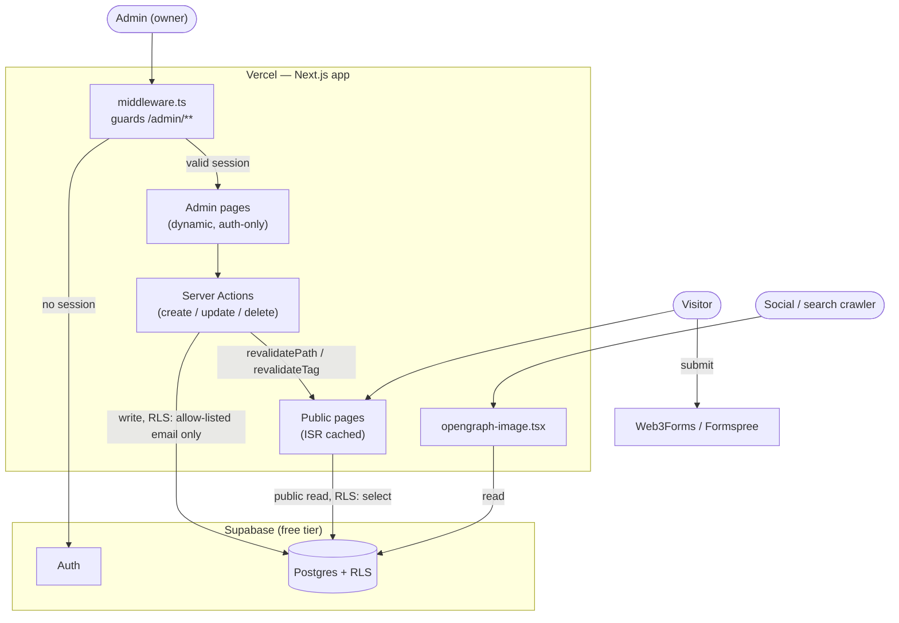
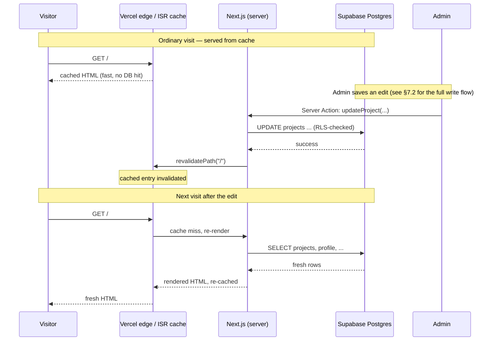
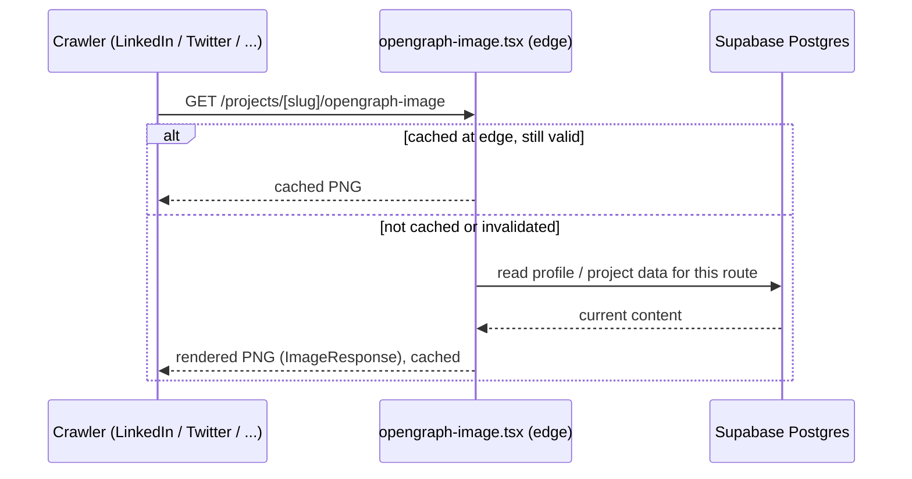
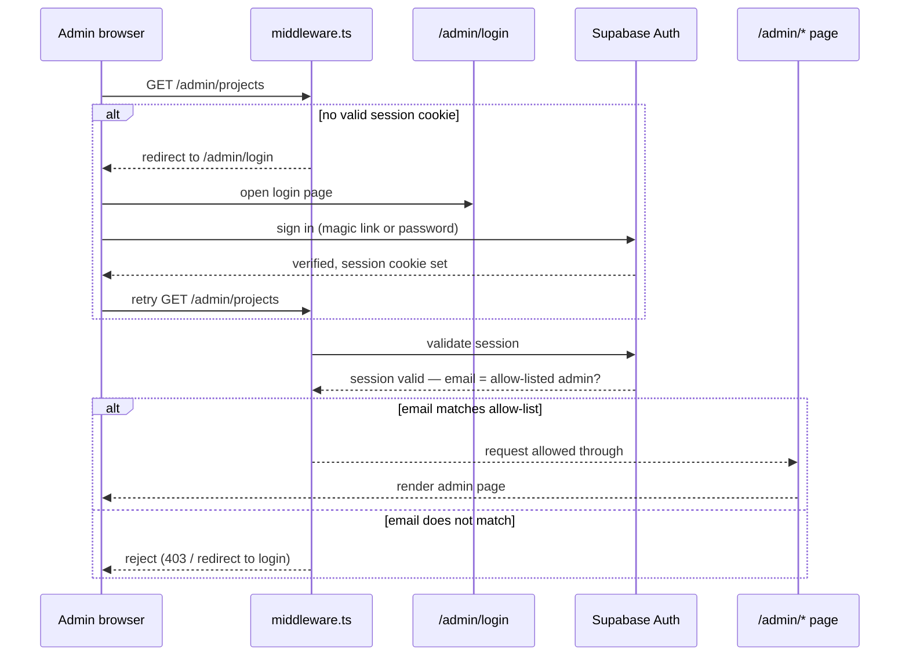
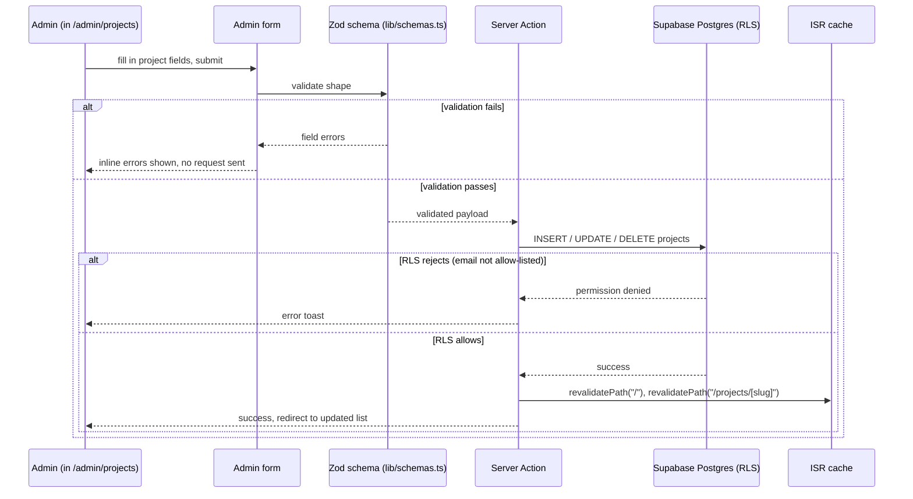

# System Design

Status: Planning phase. No code written yet.
Last updated: 2026-08-07 (revised: dynamic content + admin panel)
Companion doc: [plan.md](./plan.md) (goals/roadmap) — this doc covers *how it's built*.

> **Revision note**: This design originally used Next.js static export with content in
> hardcoded TypeScript files. The user has since asked for dynamically editable content via
> a private admin panel, which static export architecturally cannot support (no server = no
> place to write a database mutation). This version replaces static export with a standard
> Next.js/Vercel deployment backed by a real database. See decision-log.md's 2026-08-07
> "dynamic content" entry for the full reasoning. Sections below are the current, superseding
> design — no need to cross-reference the old approach.

## 1. Constraints driving every choice here

- **$0 budget.** Every tool below is on a free tier that comfortably covers a low-traffic
  personal site forever, not a trial that expires.
- **Content must be editable without a code change.** The owner adds/edits/removes projects,
  skills, experience, and profile info through a private admin UI — not by editing files and
  redeploying. This is the central new requirement and it drives the rendering strategy,
  the data layer, and the security model below.
- **The admin surface must be genuinely private**, not just unlinked. "No nav entry point"
  is a UX choice (don't clutter the public site); it is not a security control on its own.
- **Low maintenance surface.** Adding a database and auth is real added complexity versus
  the original static design — kept as small and boring as possible (one provider for both,
  standard patterns, no hand-rolled auth).

## 1a. System architecture overview

How the pieces in this doc fit together — visitors, the admin, and crawlers each take a
different path through the same Next.js app, all backed by one Supabase project.



Three things worth noticing: visitors never touch the admin path at all; the crawler path
only ever reads; and the admin's write path is the only one that reaches Supabase with write
intent — everything else is read-only by construction, before RLS even gets involved.

## 2. Tech stack (all free)

| Layer | Choice | Why | Free tier limit that matters |
|---|---|---|---|
| Framework | Next.js 14+, App Router, standard Vercel deployment (SSR/ISR + Server Actions + Route Handlers — **not** static export) | Dynamic content and admin mutations require server-side execution; static export was ruled out for this reason | N/A |
| Language | TypeScript | Typed content model + Zod schemas catch bad admin input at the boundary, not in prod | N/A |
| Database + Auth + Storage | **Supabase** (free tier) | One provider for Postgres (content tables), Auth (admin login), and Storage (optional image uploads) — avoids integrating three separate free services for what's still a small site | 500MB DB, 50k monthly active users (Auth), 1GB storage — all wildly more than a single-owner portfolio needs |
| Styling | Tailwind CSS | Fast to build with, easy to keep visually consistent, small final CSS via purge | N/A |
| Animation | **None — CSS scroll-driven animations** (`animation-timeline: view()`) | Originally planned as Framer Motion. Reveal animations turned out to need no library at all: CSS runs them off the compositor, adds nothing to the bundle, and degrades to no animation rather than to hidden content. Revisit only if something genuinely needs orchestration | N/A |
| Hosting | Vercel (Hobby/free plan) | Zero-config Next.js deploys including serverless/edge functions on the free tier, free HTTPS + custom domain, per-PR preview URLs | 100GB bandwidth/mo, generous serverless function invocation limits — far beyond a portfolio's needs |
| CI | GitHub Actions | Lint + typecheck + build on every PR before Vercel even deploys it | 2,000 min/mo free (public repo is unlimited) |
| Contact form | Web3Forms or Formspree (free tier) | No custom backend needed for this one form; POST to their free endpoint, delivered to a real inbox | Both comfortably cover a portfolio site's volume |
| Analytics | Vercel Web Analytics (free tier) | Privacy-friendly, no cookie banner needed | Capped events/mo on Hobby, sufficient here |
| Fonts | `next/font` with a Google Font, self-hosted at build time | Zero runtime request to Google, no CLS | N/A |
| Icons | `lucide-react` (MIT, tree-shakeable) | Consistent icon set, tiny bundle impact | N/A |
| Domain (optional) | User-owned, or default `*.vercel.app` | The one line item that isn't strictly free (~$10-15/yr) — explicitly optional | — |

Nothing here requires a credit card. Nothing here has a trial clock running.

## 3. Rendering strategy: why not static export anymore

The original design used Next.js static export specifically to avoid running any server.
That's incompatible with "admin edits content and it goes live" — there is no server to
receive the write. This revision uses Next.js's standard model instead:

- **Public pages**: rendered with **Incremental Static Regeneration (ISR)** — served from
  cache like a static site (fast, cheap, no per-request DB hit for most visitors), but with
  **on-demand revalidation** (`revalidatePath` / `revalidateTag`) triggered the moment an
  admin save happens. Net effect: visitors get static-speed pages, but a saved edit is live
  within seconds, not on the next deploy. This preserves nearly all the performance benefit
  of the original static design while satisfying the new dynamic requirement.
- **Admin pages**: rendered dynamically per request (always fresh, always behind auth) —
  performance targets from section 8 don't apply here, correctness and security do.
- **Portability tradeoff, acknowledged**: this does give up the "deploy anywhere for free"
  portability static export had (GitHub Pages, for instance, can't run Server Actions).
  Staying on Vercel is an explicit, accepted tradeoff for a feature (real dynamic content)
  the user asked for — not an oversight. If hosting ever needs to move, the target would need
  to support Next.js server runtime (Netlify and Cloudflare Pages both do).

### 3.1 Diagram — ISR + on-demand revalidation flow

Two timelines: an ordinary visit (served from cache, no DB hit) and what happens the moment
the admin saves an edit.



The visitor experience never changes — still cache-served, still fast — but "fast" and
"stale" stop being coupled the way they would be on plain static export.

## 4. Directory structure

```
/
├── KB/                          # planning docs — not shipped to the site
│   ├── README.md
│   ├── plan.md
│   ├── system-design.md
│   └── decision-log.md
├── middleware.ts                # protects /admin/** — redirects unauthenticated requests
├── app/
│   ├── layout.tsx               # root layout: fonts, theme provider, nav, footer
│   ├── page.tsx                 # home: composes all scroll sections
│   ├── opengraph-image.tsx      # dynamic OG image for home (Next.js file convention)
│   ├── globals.css
│   ├── resume/
│   │   └── page.tsx
│   ├── projects/[slug]/
│   │   ├── page.tsx
│   │   └── opengraph-image.tsx
│   └── admin/                   # unlisted, noindex, auth-protected
│       ├── layout.tsx           # admin shell, distinct from public layout
│       ├── login/page.tsx
│       ├── page.tsx             # dashboard / overview
│       ├── profile/page.tsx
│       ├── experience/page.tsx
│       ├── projects/page.tsx
│       └── skills/page.tsx
├── components/
│   ├── layout/                  # Nav, Footer, ThemeToggle, CommandPalette
│   ├── sections/                # Hero, About, Experience, Projects, Skills, Contact
│   ├── admin/                   # form components, table/list views, auth guard wrapper
│   └── ui/                      # small reusable primitives (Badge, Card, Button)
├── lib/
│   ├── supabase/
│   │   ├── client.ts             # browser client (anon key)
│   │   ├── server.ts             # server client (reads session cookie)
│   │   └── admin-guard.ts        # server-side helper: throws/redirects if not allow-listed admin
│   ├── actions/                  # Server Actions: createProject, updateProject, etc.
│   ├── schemas.ts                # Zod schemas — shared by admin forms and DB read/write
│   └── seo.ts                    # metadata helper (per-route generateMetadata)
├── supabase/
│   ├── migrations/                # SQL migrations (schema + RLS policies), versioned in git
│   └── seed.sql                   # placeholder content matching the real schema
├── public/
│   ├── resume.pdf
│   └── favicon assets, manifest.json, robots.txt
├── .github/workflows/ci.yml     # lint + typecheck + build gate
├── next.config.ts
└── package.json
```

## 5. Data model

Content lives in Postgres (via Supabase), not in code. Shape carries over almost 1:1 from
the original static-file design — only the storage location changed, which is exactly why
this pivot didn't require reworking the public-site component design, just its data source.

```sql
-- supabase/migrations/0001_init.sql (illustrative, not final DDL)

create table profile (
  id uuid primary key default gen_random_uuid(),
  name text not null,
  headline text not null,
  bio text not null,
  location text,
  contact_email text,
  github_url text,
  linkedin_url text,
  resume_url text,
  avatar_url text,
  updated_at timestamptz not null default now()
);
-- single row table: one owner, one profile

create table experience (
  id uuid primary key default gen_random_uuid(),
  role text not null,
  company text not null,
  start_date date not null,
  end_date date,                  -- null = current
  summary text,
  highlights text[],
  sort_order int not null default 0
);

create table projects (
  id uuid primary key default gen_random_uuid(),
  slug text unique not null,
  title text not null,
  pitch text not null,
  description text,
  stack text[] not null default '{}',
  demo_url text,
  source_url text,
  impact text,
  featured boolean not null default false,
  sort_order int not null default 0,
  created_at timestamptz not null default now()
);

create table skills (
  id uuid primary key default gen_random_uuid(),
  category text not null,
  items text[] not null default '{}',
  sort_order int not null default 0
);
```

**Row Level Security (RLS)**: enabled on every table. As implemented in
`supabase/migrations/0001_content_schema.sql`, this is enforced in two independent layers so
a mistake in either one alone is not exploitable:

1. **Privileges** — `anon` is granted `select` only, and is never granted
   `insert`/`update`/`delete` on any table. Even a policy that wrongly evaluated true could
   not let an anonymous request write, because the privilege itself is absent.
2. **Policies** — writes additionally require `public.is_admin()`. Policies are written per
   table and per operation rather than collapsed into `for all`, so the configuration is
   reviewable at a glance (security.md §4.1 rule 2).

`select` is public on all content tables — the site is a public portfolio, so no auth is
needed to *view*. This is the actual security boundary, not the unlisted admin URL.

Two implementation details worth knowing, added during the build and not in the original
sketch above:

- **`admin_allowlist` table** holds the authorized admin email(s), rather than hardcoding an
  address into every policy — changing the admin is a one-row update instead of a schema
  migration. The table has RLS enabled with **zero policies**, which makes it invisible and
  unmodifiable through the API; it is managed only via the SQL editor. Anyone able to insert
  their own address here would own the entire site, so it is deliberately not reachable from
  the internet at all.
- **`public.is_admin()`** is the single authorization predicate every write policy calls. It
  is `security definer` (so it can read the allow-list that clients cannot) with
  `search_path` pinned to `''` and all objects schema-qualified — an unpinned search path is
  the standard way `security definer` functions get hijacked. For an anonymous request
  `auth.jwt()` is null, so the lookup fails closed.

`src/lib/schemas.ts` defines Zod schemas matching these tables, used to validate admin form
submissions before they hit the database. Its validation rules deliberately mirror the SQL
`CHECK` constraints (URL protocol, slug format, date ordering); the database constraint is
the one that cannot be bypassed, and the Zod copy turns a would-be PostgREST 400 into a
readable field-level error. Small `to*Insert` helper functions exist purely so a schema that
drifts out of shape with its table fails to compile.

## 6. Social preview system (OG images, meta tags, structured data)

Simpler than the original design, because giving up static export removes the workaround it
required:

- **Meta tags**: Next.js `generateMetadata()` per route, reading live content from Supabase,
  sets `title`, `description`, `openGraph.*`, and `twitter.card = 'summary_large_image'`.
- **OG images**: Next.js's `opengraph-image.tsx` file convention — a route-colocated file
  that renders an `ImageResponse` (via `@vercel/og`) **on request**, automatically wired into
  the route's metadata, and cached at Vercel's edge. No separate build script needed; the
  image is generated from whatever's actually in the database at request time, so it can
  never drift out of sync with real content (an improvement over the original build-time-PNG
  workaround, which could go stale between content edits and rebuilds).
- **Admin route exclusion**: `/admin/**` sets `robots: { index: false, follow: false }` in
  its metadata and is excluded from `sitemap.xml` — it must never surface in a search result
  or social unfurl.
- **Structured data**: JSON-LD `Person` schema injected in the root layout — `name`,
  `jobTitle`, `url`, `sameAs: [github, linkedin]`, sourced from the `profile` table.

### 6.1 Diagram — OG image request flow



Same edge-caching shape as §3.1 — cheap on the common path, always sourced from whatever's
actually in the database, never a hand-maintained image someone forgot to update.

**Verification checklist** (part of Phase 5's definition of done, per plan.md):
- [ ] LinkedIn Post Inspector shows correct title/description/image
- [ ] Twitter Card Validator renders `summary_large_image` correctly
- [ ] Facebook Sharing Debugger shows correct preview (also covers WhatsApp/iMessage-style
      unfurls, which reuse OG tags)
- [ ] `/admin` confirmed absent from Google (`site:` search) and does not unfurl a preview

## 7. Admin panel: access model and security

The user's requirement: no entry point anywhere in the public site, reachable only by direct
URL. That's a reasonable UX choice — but worth being explicit that **it is not, by itself, a
security boundary**, and this design treats it as exactly that: a UX nicety layered on top of
real authentication, not a substitute for it. Reasons a URL-only gate fails in practice:
referrer headers can leak it to third parties, it ends up in browser history/autofill and
Vercel's own access logs, and route names are often guessable (`/admin` is the first thing
anyone tries). A portfolio built to impress a senior-engineer audience is also, uncomfortably,
the most likely place a technically curious visitor pokes at `/admin` out of curiosity — so
this needs to actually hold.

**Design**:
1. **Route is unlisted**: not in nav, footer, sitemap.xml, or any on-page link. Satisfies
   the "no entry point" ask at the UX layer.
2. **`middleware.ts` protects `/admin/**`**: every request to an admin path checks for a
   valid Supabase session; unauthenticated requests are redirected to `/admin/login`. This
   runs before any admin page code executes.
3. **Login is real auth, not a shared password**: Supabase Auth (email + password, or magic
   link — magic link avoids a password to manage at all, recommended default). Only the
   allow-listed admin email can ever complete login — enforced server-side.
4. **Authorization, not just authentication**: even after login, every write path (Server
   Action *and* the RLS policy in section 5) independently checks the session's email against
   the single allow-listed admin address. Defense in depth: a bug in one layer doesn't expose
   writes.
5. **Search engines and crawlers**: `noindex, nofollow` + sitemap exclusion (section 6) means
   the route can't be *found* via search, narrowing exposure to "someone with the literal URL."
6. **No secrets in the client bundle**: the Supabase *anon* key is meant to be public (it's
   how the public site reads content) and is safe to ship client-side because RLS is what
   actually restricts writes — not key secrecy. No service-role key is used in this design at
   all, specifically so there's no privileged secret that would be catastrophic if leaked.

This is the same shape a real internal admin tool would use — "hidden but real" is a fine
UX pattern; "hidden instead of real" is the anti-pattern this design avoids.

### 7.1 Diagram — admin authentication flow



The allow-list check happens in `middleware.ts` on every request, not just at login — a
still-valid session for a non-admin email (in principle there shouldn't be one, since sign-up
is restricted, but this is the "defense in depth" layer from point 4 above) gets rejected on
each hit, not just the first.

### 7.2 Diagram — admin content write flow

Example: saving a project from the admin UI. Same shape for experience, skills, and profile.



Two independent checks gate a write: Zod (shape) before the request is even sent, and RLS
(identity) at the database itself — a bug that skipped the Zod check still can't produce an
unauthorized write, because Postgres enforces the identity check regardless of what the
application code did or didn't verify.

## 8. Navigation & interactivity architecture (public site)

- **Single-page scroll** for the home route: sections are `<section id="...">` with
  `scroll-margin-top` for anchor offset under the sticky nav.
- **Active-section nav** via `IntersectionObserver` in `components/layout/section-nav.tsx`
  (no scroll-event listener or throttling to tune). Progressive enhancement: the links are
  plain anchors that work with no JavaScript, so a failure costs the highlight, never
  navigation. The observer uses a `rootMargin` band across the upper-middle of the viewport,
  otherwise a section counts as visible the instant one pixel appears at the bottom of the
  screen and the highlight runs ahead of what is being read. Visible sections are tracked in a
  ref because the observer callback only reports entries that *changed*. The active link
  carries `aria-current="location"`, since assistive tech cannot see a colour change.
- **Command palette** (`Cmd/Ctrl+K`): a lightweight library (e.g. `cmdk`, MIT-licensed) with
  actions defined declaratively (jump to section, open GitHub, open LinkedIn, download resume,
  toggle theme). Deliberately does **not** list or hint at the admin route.
- **Scroll reveal animations**: a CSS scroll-driven animation (`animation-timeline: view()`)
  on a `.reveal` class, defined in `globals.css`. No JavaScript and no library.
  Double-guarded — wrapped in `@media (prefers-reduced-motion: no-preference)` so an OS-level
  request for less motion gets none, and in `@supports (animation-timeline: view())` so the
  hidden starting state exists only where it can actually be animated away. That second guard
  is the important one: a class-toggling approach starts elements at `opacity: 0` and reveals
  them from a script callback, so a script failure leaves a blank page. Here, any browser that
  cannot run the animation simply shows everything.
- **Theme**: CSS variables + a `ThemeProvider` (e.g. `next-themes`), defaults to system
  preference, persisted via `localStorage`, no flash-of-wrong-theme.

## 9. Performance & accessibility budget (public site)

- Lighthouse: Performance ≥ 95, Accessibility ≥ 95, Best Practices ≥ 95, SEO 100
- LCP < 1.5s, CLS < 0.1, TBT < 100ms on a throttled mobile profile — ISR caching (section 3)
  keeps this achievable despite the database backing
- All interactive elements keyboard-reachable with visible focus states
- Color contrast meets WCAG AA in both light and dark themes
- Images: `next/image` with explicit dimensions, served as WebP/AVIF automatically
- Admin panel is exempt from the visual-polish bar but not from basic usability (forms must
  be keyboard-operable, show validation errors clearly — it's still software, just not the
  audience-facing kind)

## 10. CI/CD pipeline

```
PR opened/updated
  └─ GitHub Actions: install → lint (eslint) → typecheck (tsc) → build
       └─ pass → Vercel auto-generates a preview deploy URL on the PR
            └─ merge to main → Vercel deploys to production URL
```

Database migrations (`supabase/migrations/`) are applied via the Supabase CLI as an explicit,
reviewed step — never auto-applied by CI without review, since schema changes are harder to
undo than a code deploy.

## 11. Security & abuse surface

> **Full detail lives in [security.md](./security.md)** — threat model, per-entry-point
> attack/defense tables (DevTools, URL manipulation, Postman/direct API, forms, uploads),
> development rules, the RLS verification ritual, and per-phase security gates. The summary
> below is the architectural view; that doc is what to follow while writing code.

- **Admin auth**: see section 7 in full — this is the highest-stakes surface on the site and
  is treated accordingly (real auth, RLS-enforced authorization, no shared secrets).
- **RLS is the actual boundary**: the Supabase anon key ships in the client bundle by design
  and is trivially extractable, so the database's row-level-security policies — not the
  application code, and not the UI — are what prevent unauthorized writes. Anything reachable
  from the app is equally reachable from Postman (security.md §3.3).
- **Environment variables**: Supabase URL + anon key (public by design), stored as Vercel env
  vars regardless (not hardcoded) so they can be rotated without a code change. No
  service-role key used (section 7.6).
- **Contact form**: rely on the form provider's (Web3Forms/Formspree) built-in spam filtering;
  add a honeypot field as a free extra layer.
- **CSP headers**: set via `next.config` headers to restrict script/style/img sources to self
  + known providers (fonts, Supabase, form endpoint).
- **Rate limiting on login**: Supabase Auth has built-in abuse protection on auth endpoints
  (backoff on repeated failed attempts); not something this project needs to hand-roll.
- **Dependabot** (free on GitHub) enabled for dependency vulnerability alerts.
- **Audit trail** (nice-to-have, not v1): `updated_at` timestamps exist on every table as a
  baseline; a full change history table is easy to add later if useful, cut from v1 scope.

## 12. What's explicitly out of scope (and why)

- **Third-party CMS product** (Contentful, Sanity, etc.) — the self-built admin in this
  design is small enough (4 content types, single owner) that a dedicated CMS integration
  and its own free-tier limits would be net-more complexity, not less.
- **Multi-admin / roles / permissions** — single owner, one allow-listed email is sufficient;
  adding a roles system would be speculative complexity.
- **Blog** — not requested; would add a content system (MDX or DB-backed posts) with its own
  ongoing maintenance cost. Could be added later as its own phase — the database-backed
  architecture doesn't block it.
- **i18n** — single-audience (English-speaking recruiters), not worth the complexity now.
- **Admin revision history / rollback** — noted as cuttable in plan.md §3a; `updated_at`
  columns give a minimal safety net without building a full versioning system.

## 13. Risks & mitigations

| Risk | Mitigation |
|---|---|
| Admin URL leaks and someone attempts unauthorized access | Real auth + RLS (section 7) means knowing the URL alone grants nothing; login still required and restricted to one allow-listed email |
| Supabase free tier ever becomes insufficient | Portfolio-scale traffic is far below free-tier limits (section 2); Postgres means a paid-tier upgrade or self-host migration is standard, not a rewrite |
| ISR revalidation bug causes stale content after an admin edit | `revalidatePath`/`revalidateTag` called explicitly in every write Server Action, not left implicit; a manual "force refresh" admin action is a cheap fallback to add |
| Over-animating hurts performance/perceived quality (public site) | Motion budget defined in plan.md §4; performance targets in section 9 are a hard gate |
| Losing static-export portability (section 3) | Explicit, accepted tradeoff for the dynamic-content requirement; Netlify/Cloudflare Pages both support Next.js server runtime if a future move is needed |
| Placeholder content shipped accidentally as "final" | Phase 6 in plan.md is a named, tracked step; seed data uses obviously-fake values so it can't pass as real by accident |
