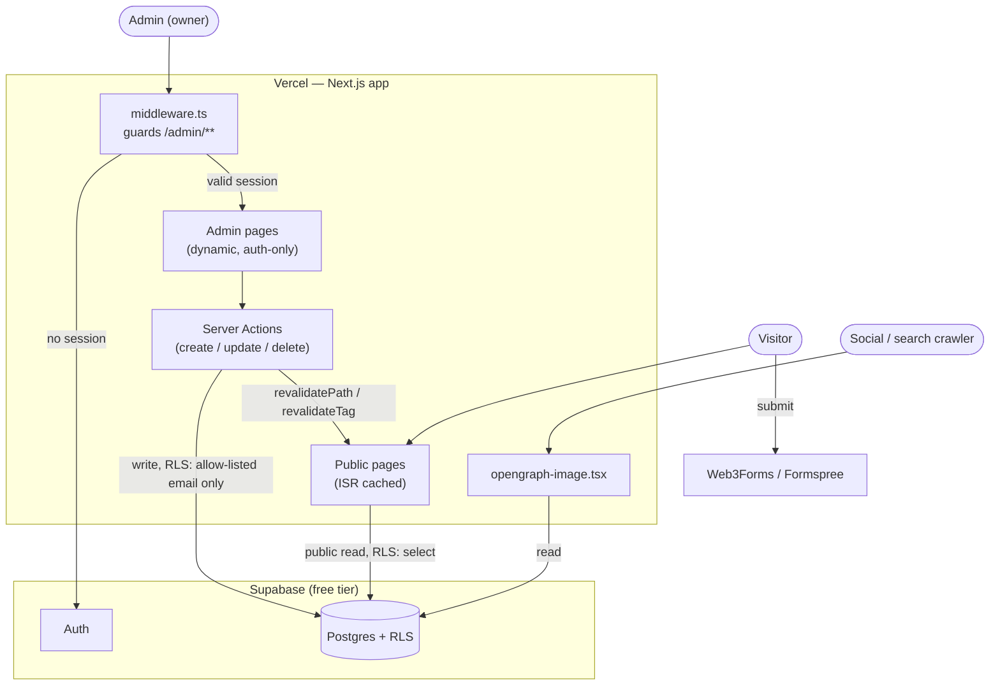

# Architecture

Condensed from the full spec — see
[`/KB/system-design.md`](https://github.com/mudgalprashant/home/blob/main/KB/system-design.md)
in the repo for the complete design, including the ISR, OG-image, and admin-auth flow
diagrams not reproduced here.

## Stack

| Layer | Choice |
|---|---|
| Framework | Next.js 14+, App Router, standard Vercel deployment (SSR + Server Actions + ISR) |
| Database / Auth / Storage | Supabase (free tier) |
| Styling | Tailwind CSS |
| Animation | Framer Motion |
| Hosting | Vercel (Hobby/free) |
| Contact form | Web3Forms or Formspree (free tier, no custom backend) |

Everything above runs on a free tier with no trial clock — see `/KB/system-design.md` §2 for
exact limits and the reasoning behind each choice.

## How it fits together

Visitors only ever read. The admin path is the only one with write intent, and every write
is gated twice — once by session auth in `middleware.ts`, and again by a Postgres
row-level-security policy that only allows the single allow-listed admin email to write. See
[Admin Guide](Admin-Guide.md) for what that looks like in practice, and
`/KB/system-design.md` §7 for the full security reasoning.

## Why dynamic instead of static

The site is intentionally not a static export. Content (projects, skills, experience) needs
to be editable by the owner without a code change or redeploy, which requires a real
backend. Public pages still use Incremental Static Regeneration, so visitors get
static-site-like speed — an admin save just triggers on-demand revalidation instead of
waiting for the next deploy. Full detail in `/KB/system-design.md` §3.
